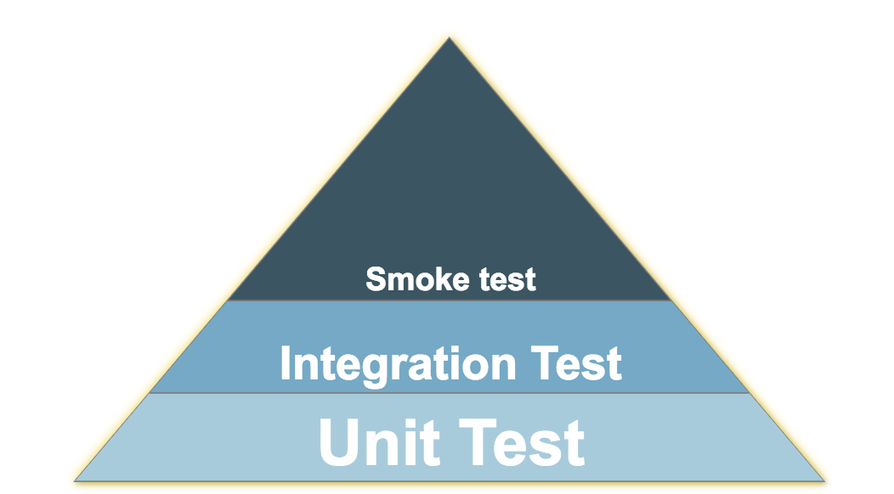
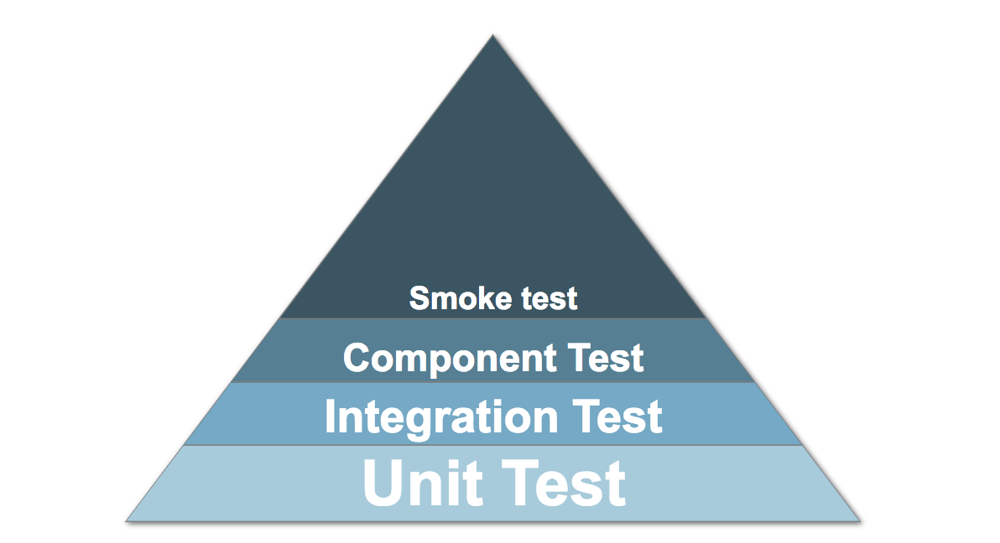
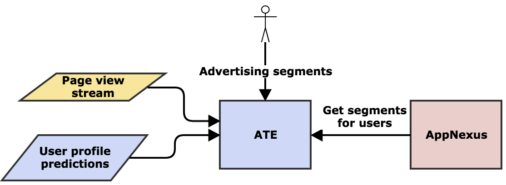
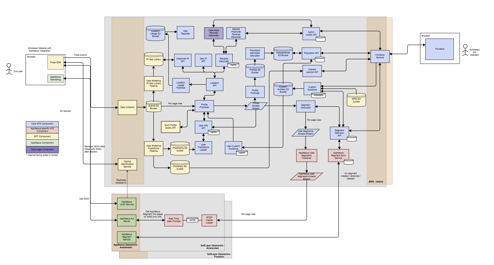
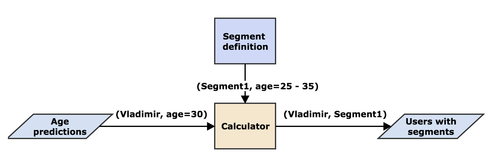

@title[Introduction]

# ATE Component Tests

---
@title[Plan]
## Plan

* What is ATE
* Component in testing pyramid
* Evaluation of component test in ATE
* Best practices
---
#### Where will you place component test?


---
#### Component test

---
## Requirements for component tests
* Close to production
* Blackbox 
* Fast feedback
* Stable
* Running locally
* Easy to read, ideally describes what service is doing

Note: 
I worked in a project which did computation on hadoop using hive. There project calculated some advertising metrics, so the numbers themselfs didn't mean a lot to programmers. In order to do a simplest change we needed to run a component test. The test on hadoop took ~1h. It was flaky. The output was just a bunch of numbers, so I coulnd say are they correct or not. morrover there was an invisible simbol separator that made the results completly unreadable. It took about two days to submit a change of 10 minutes coding. It was such a waste of time changing something in that project.
Why am I telling this story - don't do like this.
Since that time I began particulary sensity
---

@title[What is ATE]

## What is ATE?



---

@title[What is ATE]

## What is ATE?


Note: diagram here pulse, um, users -> ATE -> users/segments
to undertand the scope of the problem.
---

@title[What is ATE]

## What is ATE?
#### 15 backend engeneers
#### 63 gihub repos
#### 25 microservices
##### Scala Ec2 S3 Kineis SQS Postgres Aerospike
###### Cassandra Spark ElasticSearch 

---


## Initial state
### Only Unit, Integration and Smoke Tests
* Test manually via datadog in dev and pre environments
* Integration test using dev AWS
* Component test with mocked AWS (sometimes)

---
## Issues
* Issues in juice in dev
* Long feedback loop 
* Shared AWS resources between tests / lots of AWS garbage
* Not very stable
* Issues with local run / security 
* Slow
---
### Shared docker lib

[shared-docker-test-containers](https://github.schibsted.io/spt-advertising/shared-docker-test-containers)
---
## Example of a microservice


---
## Setup Kinesis
```
class AteOfflineCalculatorComponentTest
  extends FeatureSpec
  with Matchers
  with BeforeAndAfterEach
  with BeforeAndAfterAll
  with DockerForAllTestOps
  with Eventually {

  private val server = new EmbeddedHttpServer(twitterServer = new AteOfflineCalculatorServer)

  private var wireMockServer: WireMockServer = _

  private var userId: String = _

  private val kinesisInputStreamName = "input-stream"
  private val kinesisOutputStreamName = "output-stream"

  private val kinesisContainerHolder =
    registerContainerRunner(
      KinesisContainerDetailsBuilder.withDynamicPort().get.build()
    )
  private val dynamoContainerHolder =
    registerContainerRunner(
      DynamoDbContainerRunnerBuilder.withDynamicPort().build()
    )

  private val aerospikeContainerHolder =
    registerContainerRunner(
      AerospikeContainerRunnerBuilder.withDynamicPort().build()
    )

  override protected def beforeAll(): Unit = {
    super.beforeAll()

    setupWireMock()
    setupKinesis()
    setupAerospike()

    server.start()
    waitForKinesisToInit(server.injector.instance[DatadogClient].asInstanceOf[FakeMetricClient])
  }

  private def setupKinesis(): Unit = {
    val kinesisClient = kinesisContainerHolder.container.newClient()
    createStream(kinesisClient, kinesisInputStreamName)
    createStream(kinesisClient, kinesisOutputStreamName)
    sys.props += "spt.kinesis.consumer.streamName" -> kinesisInputStreamName
    sys.props += "spt.kinesis.publisher.streamName" -> kinesisOutputStreamName
    sys.props += "spt.kinesis.endpoint" -> kinesisContainerHolder.container.endpoint
    sys.props += "spt.dynamodb.endpoint" -> dynamoContainerHolder.container.endpoint
  }

  private def createStream(kinesisClient: AmazonKinesis, kinesisStreamName: String): Unit = {
    kinesisClient.createStream(kinesisStreamName, 1)
    (1 to 120).toStream
      .map(_ => kinesisClient.describeStream(kinesisStreamName).getStreamDescription.getStreamStatus)
      .takeWhile(_ != "ACTIVE").last
  }

```
@[6]
@[18-20]
@[32,36,41]
@[43-50]
@[32,40-41]
---
## Setup segment definition stub
```
private def setupWireMock(): Unit = {
  wireMockServer = new WireMockServer(WireMockConfiguration.wireMockConfig().dynamicPort())
  wireMockServer.start()
  stubSegmentDefinitionWithSegmentPages()

  val host = s"localhost:${wireMockServer.port()}"
  sys.props += ("spt.segmentDefinition.hosts" -> host)
}

private def stubSegmentDefinitionWithSegmentPages(): Unit = {
  wireMockServer.stubFor(
    get(urlPathEqualTo("/v6/segments"))
      .withQueryParam("page", new EqualToPattern("1"))
      .withQueryParam("page_size", new RegexPattern("[0-9]+"))
      .willReturn(
        aResponse()
          .withStatus(200)
          .withBody(segmentsJson)
      )
  )
}

private val segmentsJson: String =
  s"""[
     |  {
     |    "id": "segment-age-one-bracket",
     |    "value": { 
     |       "ageCriteria": { 
     |         "ageBrackets": [ { "lower": 18, "upper": 25 } ], 
     |         "version": 10
     |       } 
     |    }
     |  },
```
@[1-2,4]
@[10-21]
@[26-32]

---
## Tests 
```
feature("age criterion matching") {
  scenario("user matches criterion with single age bracket") {
    sendMessageAndVerifyOutput(
      input = UserPropertyDTO.PropertyType.Age(AgeDTO(22)),
      expectedOutput = CriteriaByType(CriterionType.AGE, Seq(CriterionReference("segment-age-one-bracket", 10)))
    )
  }

  scenario("user does not match criteria any more") {
    sendMessageAndVerifyOutput(
      input = UserPropertyDTO.PropertyType.Age(AgeDTO(75)),
      expectedOutput = CriteriaByType(CriterionType.AGE, Seq.empty)
    )
  }
}
```
@[1]
@[2-7]
@[9-15]
Note: Mention:
1) Not only happy path 
2) Use buisness use-cases
---
### Issues  
  - not 100% similarity between environments (if isLocal)
  - mocked data in services, can be wrong assumptions
  - dockerised AWS components may not be 100% identical to real ones
---
### Component test using docker
  - fast
  - close to prod
  - nearly blackbox
---
* Use as a blackbox
  * Don't check DB
  * Don't mock juice modules
  * Test one thing at a time 
  * Check not only one happy path, but business related feature
  
Note: Example is age calculator that says that we should return an empty list if there is no age segments.
---

##
1) what is ATE
    - backed, 20 + micro services (http/sqs/kinesis)
2) component in testing piramind
    - unit/ integration / component / smoke test 
3) what requirements for component test
    - close to production
    - blackbox 
    - fast
    - running locally
4) Initial state: No component test:
    - test manually via datadog in dev / pre
    - failures in dev with juice 
    - very long feedback loop
5) Intermediate state: integration test using real AWS
    - slow
    - shared resources between tests
    - not very stable
    - leave lots of garbage in aws
    - issues with local run / security 
6) Component test using docker
    - fast
    - close to prod
    - nearly blackbox
    - not 100% similarity between environments (if isLocal)
    - mocked data in services, can be wrong assumptions
7) Component test best practices
    - use as blackbox, don't' check the db
    - don't mock "inconvenient" classes
    - test one thing 
    - check not only one happy path, but business related feature.
